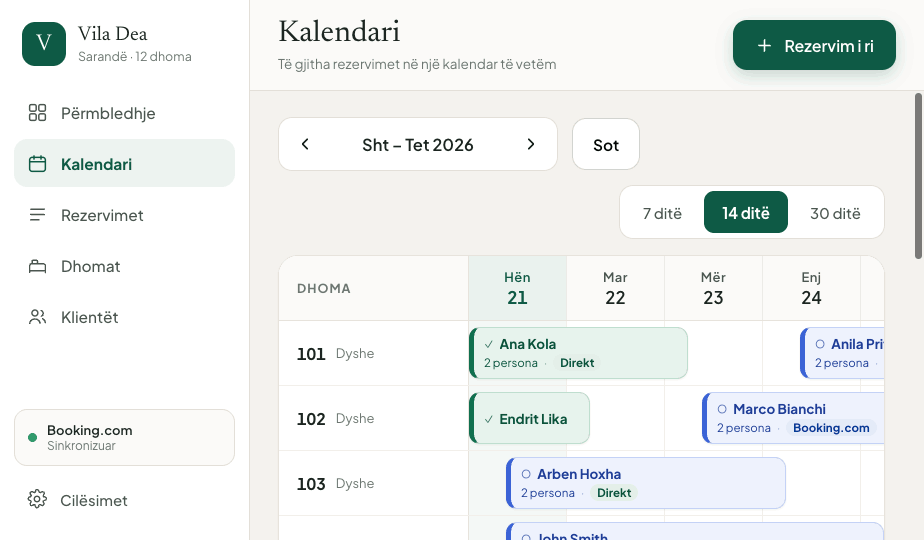
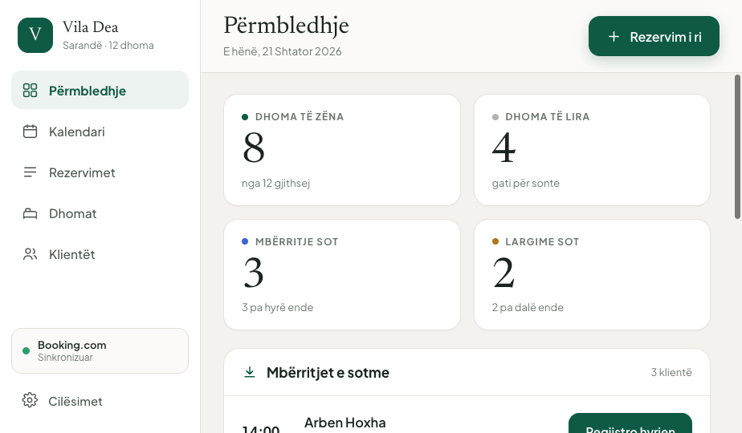
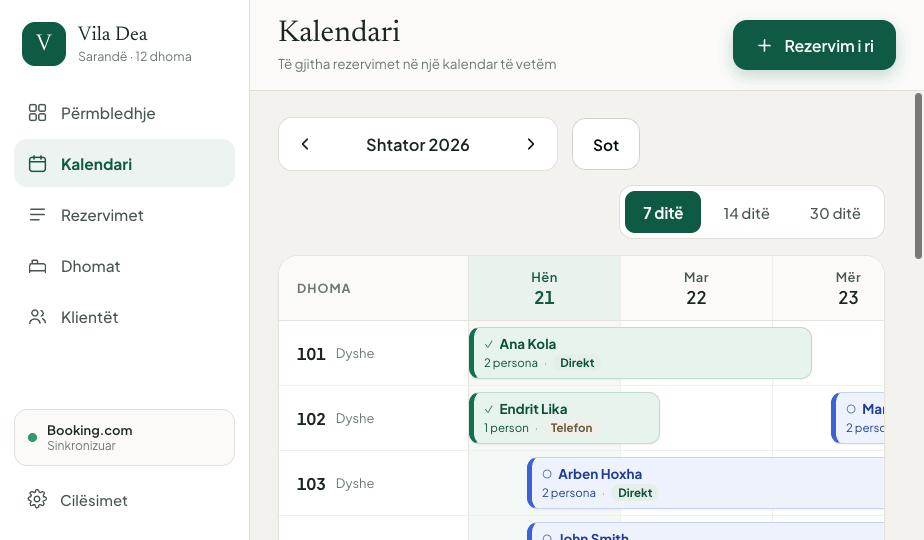
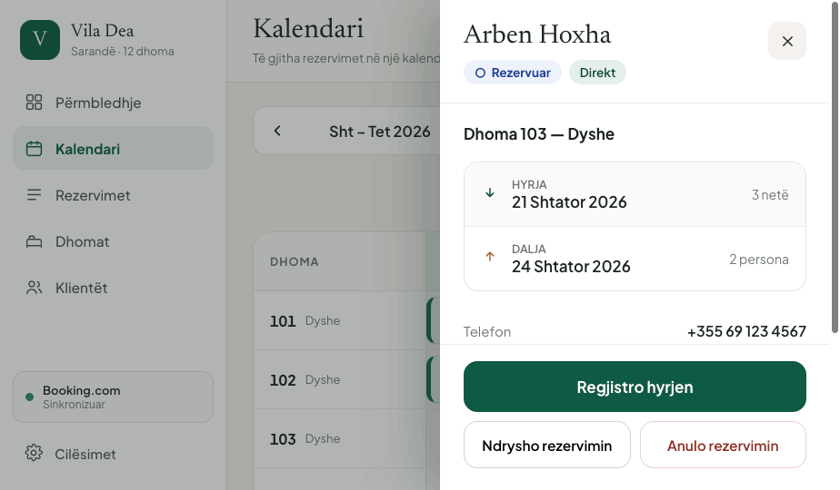
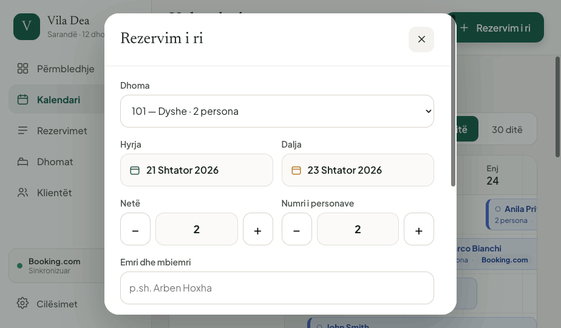
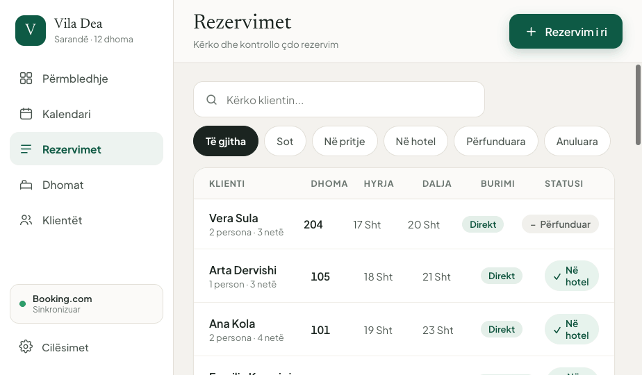
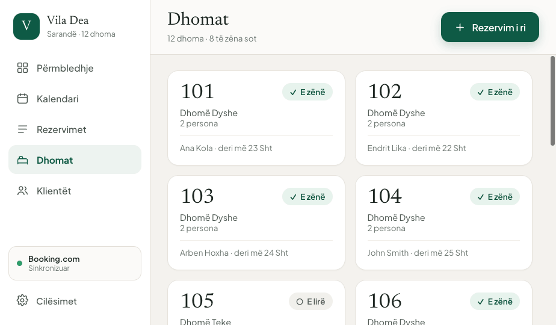
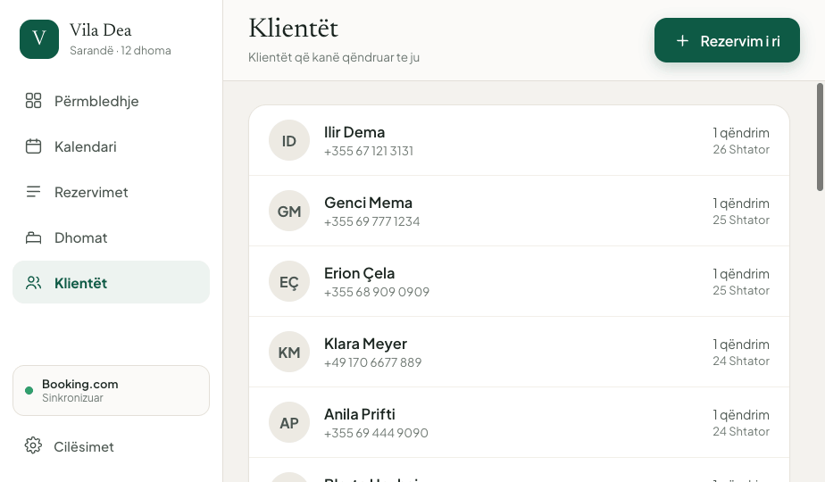
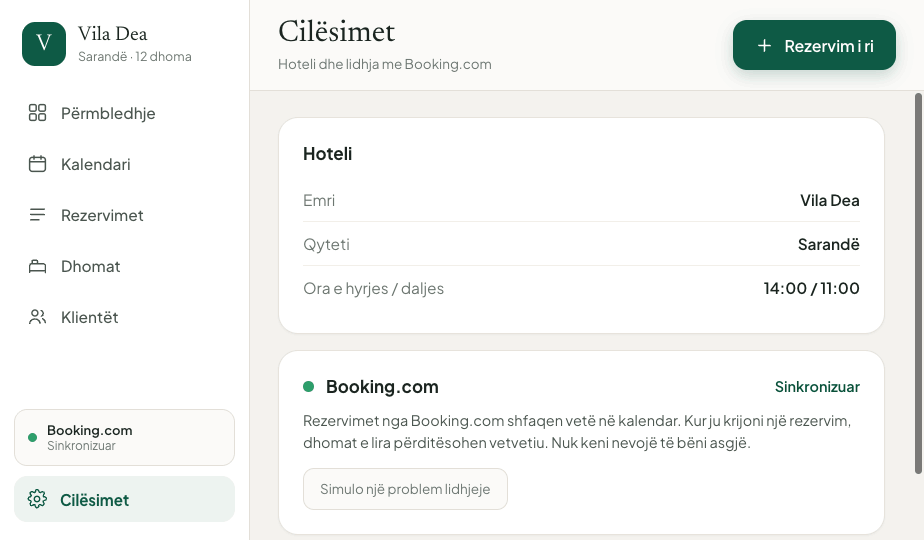

# Vila Dea — Recepsion · Udhëzues Ndërtimi (React)

Dokument zbatimi për zhvilluesin. Dizajni referencë: `Recepsion.dc.html` (prototip i plotë, i klikueshëm).
Pamjet: `docs/screenshots/` · Skedarët referencë: `docs/reference/`

Gjuha e UI-së: **vetëm shqip**. Terminologjia teknike (channel manager, OTA, sync, inventory) nuk shfaqet asnjëherë në ekran.

---

## 1. Stack

| Shtresë | Zgjedhja | Pse |
|---|---|---|
| UI | **React 19** (`react`, `react-dom`) | Actions + `useOptimistic` për check-in/out pa spinner |
| Build | **Vite 7** + TypeScript 5.6+ | HMR i shpejtë, mbështetje native e CSS Modules + Sass |
| Routing | **react-router v7** (declarative mode) | 6 rrugë, nested layout, `useSearchParams` për gjendjen e kalendarit |
| Server state | **@tanstack/react-query v5** | cache, refetch në fokus, mutacione optimiste (kritike për kalendarin) |
| Client state | **zustand v5** | gjendje e vogël UI: view 7/14/30, data e nisjes, drawer/modal |
| Forma | **react-hook-form v7** + **zod v3** + `@hookform/resolvers` | forma e rezervimit, validim i lehtë |
| Data | **date-fns v4** + `date-fns/locale/sq` | formatim shqip, aritmetikë netësh |
| Tekste | **i18next** + **react-i18next** | të gjitha stringat në `sq.json`, asnjë tekst i hardkoduar |
| Realtime | `EventSource` (SSE) nativ | rezervimet nga Booking.com hyjnë vetë në kalendar |
| Ikona | SVG lokale si komponentë React (`src/components/icons`) | pa varësi, stroke = `currentColor` |
| Animacion | CSS `@keyframes` (default) · `motion` v12 vetëm nëse nevojitet orkestrim | modal/drawer janë tranzicione të thjeshta |
| Virtualizim | `@tanstack/react-virtual` **vetëm nëse > 60 dhoma** | ndryshe DOM-i është i vogël |
| Testim | **vitest** + `@testing-library/react` + **playwright** + **msw** | njësi, integrim, E2E të flukseve kryesore |
| Cilësi | eslint (flat config) + prettier + **stylelint** (`stylelint-config-standard-scss`, `stylelint-config-css-modules`) | |

### Biblioteka që NUK përdoren
MUI, Ant Design, Chakra, shadcn/ui, Radix, Bootstrap, Tailwind, react-big-calendar, FullCalendar, dnd-kit.
**Të gjithë komponentët e përbashkët ndërtohen nga e para** (`src/components/ui/`), me SCSS Module të vetin.
Kalendari dhe tërheqja (drag) implementohen me pointer events në një hook të vetin — shih §6.

---

## 2. Struktura e projektit

```
src/
  main.tsx
  App.tsx                       # <RouterProvider>
  routes.tsx
  styles/
    _tokens.scss                # CSS custom properties (burimi i vetëm i së vërtetës)
    _mixins.scss                # mixin + funksione (vetëm compile-time)
    _breakpoints.scss
    abstracts.scss              # @forward tokens/mixins/breakpoints  -> injektohet kudo
    global.scss                 # reset, font-face, :root, base elements
  lib/
    api/                        # fetch client + endpoints
      client.ts  reservations.ts  rooms.ts  guests.ts  sync.ts
    date/
      calendar.ts               # dayIndex, rangeOf, fmtGjate, fmtShkurter, netLabel
    format/
      money.ts  persons.ts
    hooks/
      useDragSelect.ts  useEventSource.ts  useMediaQuery.ts
  store/
    calendarStore.ts            # view, startDate, seleksioni
    uiStore.ts                  # drawer/modal/toast
  types/
    domain.ts                   # Room, Reservation, Guest, enums
  i18n/
    index.ts
    sq.json
  components/
    ui/                         # SHARED, 100% custom
      Button/       Button.tsx        Button.module.scss
      IconButton/   Badge/    StatusBadge/  SourceBadge/
      Card/         KpiCard/  Field/        TextInput/
      NumberStepper/ Select/  SearchInput/  SegmentedControl/
      FilterChip/   Modal/    Drawer/       Toast/  Toaster/
      Avatar/       EmptyState/  Spinner/   VisuallyHidden/
    icons/
      index.tsx
  features/
    permbledhje/
      PermbledhjePage.tsx  PermbledhjePage.module.scss
      ArrivalRow.tsx       ArrivalRow.module.scss
      DepartureRow.tsx     DepartureRow.module.scss
    kalendari/
      KalendariPage.tsx        KalendariPage.module.scss
      CalendarToolbar.tsx      CalendarToolbar.module.scss
      CalendarGrid.tsx         CalendarGrid.module.scss
      CalendarHeaderRow.tsx    RoomRow.tsx   DayCell.tsx
      ReservationBlock.tsx     ReservationBlock.module.scss
      CalendarLegend.tsx       CalendarLegend.module.scss
    rezervimi/
      ReservationFormModal.tsx ReservationFormModal.module.scss
      ReservationDrawer.tsx    ReservationDrawer.module.scss
      reservationSchema.ts
    rezervimet/   RezervimetPage.tsx  RezervimetPage.module.scss  ReservationRow.tsx
    dhomat/       DhomatPage.tsx      DhomatPage.module.scss      RoomCard.tsx
    klientet/     KlientetPage.tsx    KlientetPage.module.scss    GuestRow.tsx
    cilesimet/    CilesimetPage.tsx   CilesimetPage.module.scss   SyncStatusCard.tsx
  layout/
    AppShell.tsx  AppShell.module.scss
    Sidebar.tsx   Sidebar.module.scss
    Topbar.tsx    Topbar.module.scss
```

Rregull: **një `.module.scss` pranë çdo komponenti dhe çdo faqeje.** Asnjë stilim global përveç `styles/global.scss`.

---

## 3. Konvencionet e SCSS

`vite.config.ts`:

```ts
export default defineConfig({
  plugins: [react()],
  resolve: { alias: { '@': '/src' } },
  css: {
    modules: { localsConvention: 'camelCaseOnly', generateScopedName: '[name]__[local]__[hash:base64:5]' },
    preprocessorOptions: {
      scss: { api: 'modern-compiler', additionalData: `@use "@/styles/abstracts" as *;` }
    }
  }
});
```

Rregullat:

1. **Tokens = CSS custom properties** në `:root` (`_tokens.scss`). Në module përdor `var(--c-accent)`, jo variabla Sass për ngjyra — kjo lejon temë të errët më vonë pa rikompilim.
2. **Sass përdoret vetëm** për mixin-e, media query, maps, `@use`. Asnjë `@import` (i deprekuar).
3. Emërtim klasash: `camelCase` (`.roomRow`, `.isActive`), sepse `localsConvention: camelCaseOnly`.
4. Gjendjet: klasa `is*` të kompozuara me `clsx` — `clsx(s.button, variant && s[variant], isActive && s.isActive)`.
5. Maksimumi 2 nivele ndërfutje. Pseudo-elementet dhe `&:hover` po; selektorë të gjatë jo.
6. Asnjë vlerë e papërpunuar: pa hex, pa `px` spacing jashtë shkallës — përdor `var(--s-3)`, `var(--r-lg)`, `var(--c-line)`.
7. `:global` lejohet vetëm për `@keyframes` të përbashkët dhe klasa nga librari të treta (nuk kemi).

Model i një moduli (`Button.module.scss`):

```scss
.button {
  display: inline-flex; align-items: center; gap: var(--s-2);
  block-size: var(--control-h);           // 50px — target i madh klikimi
  padding-inline: var(--s-5);
  border: 1px solid transparent; border-radius: var(--r-lg);
  font: var(--t-button); cursor: pointer;
  transition: background-color .15s ease, border-color .15s ease;

  &:focus-visible { outline: 3px solid var(--c-focus); outline-offset: 2px; }
  &:disabled { background: var(--c-disabled-bg); color: var(--c-disabled-fg); cursor: not-allowed; }
}
.primary   { background: var(--c-accent); color: var(--c-on-accent); box-shadow: var(--sh-accent);
             &:hover:not(:disabled) { background: var(--c-accent-strong); } }
.secondary { background: var(--c-surface); color: var(--c-ink); border-color: var(--c-line-strong);
             &:hover:not(:disabled) { background: var(--c-bg); } }
.danger    { background: var(--c-surface); color: var(--c-danger-fg); border-color: var(--c-danger-line); }
.block     { inline-size: 100%; justify-content: center; }
```

---

## 4. Tokens

Burimi: `docs/reference/tokens.scss` (kopjoje te `src/styles/_tokens.scss`).
Pika kryesore: sfond letre `#F4F2EE`, kartat të bardha, jeshile e thellë `#0E5A45` si e vetmja ngjyrë veprimi, tipografi `Plus Jakarta Sans` + `Newsreader` (vetëm për numra/tituj).

Shkalla e hapësirës: 4 → 48 (`--s-1 … --s-8`). Rrezet: 10/13/15/18/24. Lartësia e kontrolleve: 46 / 50 / 54 px.

---

## 5. Modeli i të dhënave & API

Tipat: `docs/reference/types.ts`. Mock: `docs/reference/mock-data.ts` (e njëjta e dhënë si prototipi).

```
GET    /api/rooms
GET    /api/reservations?from=YYYY-MM-DD&to=YYYY-MM-DD
POST   /api/reservations                 -> krijon (source = "DIREKT"), backend-i njofton Booking.com
PATCH  /api/reservations/:id             -> ndryshime fushash
POST   /api/reservations/:id/check-in
POST   /api/reservations/:id/check-out
POST   /api/reservations/:id/cancel
GET    /api/guests
GET    /api/sync/status                  -> { ok: boolean, lastSyncAt: ISO }
POST   /api/sync/retry
GET    /api/stream                       -> SSE: reservation.created | reservation.updated | sync.status
```

Rregulla kyçe: **disponueshmëria nuk sinkronizohet nga klienti.** UI-ja vetëm krijon rezervimin; backend-i përditëson Booking.com. Klienti shfaq vetëm konfirmimin me dy rreshta.

React Query:

```ts
const key = ['reservations', from, to] as const;
useMutation({
  mutationFn: createReservation,
  onMutate: async (draft) => { /* optimistic: shto bllokun në kalendar menjëherë */ },
  onError: (_e, _v, ctx) => qc.setQueryData(key, ctx.prev),
  onSettled: () => qc.invalidateQueries({ queryKey: ['reservations'] })
});
```

SSE-ja bën `qc.setQueryData` — asnjë buton "Sinkronizo" në UI.

---

## 6. Kalendari (ekrani më i rëndësishëm)



Gjeometria:

- Kolona e majtë e dhomave: `190px`, `position: sticky; inset-inline-start: 0`.
- Gjerësia e kolonës sipas pamjes: **7 ditë → 152px · 14 ditë → 98px · 30 ditë → 56px**. Default **14**.
- Lartësia e rreshtit: 64px (komod) / 52px (kompakt).
- Kontejneri: `overflow-x: auto`, brendësia `width: max-content; min-width: 100%`.

Pozicionimi i bllokut (gjysmë-dite, si PMS-të reale):

```
left  = (max(res.in, rangeStart) - rangeStart) * colW + (res.in >= rangeStart ? colW * 0.38 : 0)
right = (min(res.out, rangeEnd)  - rangeStart) * colW + (res.out <= rangeEnd ? colW * 0.28 : colW)
width = max(34, right - left - 4)
```

Kështu hyrja fillon në mes të ditës dhe dalja mbaron para mesit — dy rezervime në të njëjtën ditë nuk përplasen vizualisht.

Përmbajtja e bllokut degradon me gjerësinë: `width >= 132px` → emër + persona + burim; përndryshe vetëm emri (+ shenja `B` për Booking.com).

**Kurrë vetëm ngjyrë**: çdo bllok ka një shenjë teksti — `✓` Në hotel, `○` Rezervuar, `–` Përfunduar, `✕` Anuluar — e shpjeguar te legjenda poshtë grid-it.

`useDragSelect` (pa bibliotekë):

```ts
onPointerDown(roomId, dayIndex)  -> setSel({ roomId, a: dayIndex, b: dayIndex }), e.currentTarget.setPointerCapture(e.pointerId)
onPointerEnter(dayIndex)         -> nëse sel && sel.roomId === roomId -> sel.b = dayIndex
pointerup (window)               -> hap modalin me [min(a,b), max(a,b)+1], i kufizuar te rezervimi i ardhshëm
Escape                           -> anulo seleksionin
```

Qelizat nën një bllok nuk marrin ngjarje (blloku qëndron sipër) → nuk krijohet dot mbivendosje.

Tastiera: shigjetat lëvizin fokusin qelizë më qelizë, `Enter` = hap "Rezervim i ri", `Shift+Shigjetë` zgjeron zgjedhjen.

URL: `/kalendari?nga=2026-09-21&pamja=14` — e ndashme dhe e rifreskueshme.

---

## 7. Ekranet

| # | Rrugë | Faqe | Pamje |
|---|---|---|---|
| 1 | `/` | Përmbledhje — 4 karta + mbërritjet/largimet e sotme |  |
| 2 | `/kalendari` | Kalendari 14 ditë (default) |  |
| 3 | `/kalendari?pamja=7` | Kalendari 7 ditë |  |
| 4 | `/kalendari` | Kalendari — gjendje e dytë |  |
| 5 | drawer | Detajet e rezervimit |  |
| 6 | modal | Rezervim i ri |  |
| 7 | `/rezervimet` | Lista + kërkim + filtra |  |
| 8 | `/dhomat` | Dhomat |  |
| 9 | `/klientet` | Klientët |  |
| 10 | `/cilesimet` | Cilësimet + gjendja e Booking.com |  |

Detaje për t'u respektuar:

- **Përmbledhje** — numrat në `Newsreader` 52px; butonat "Regjistro hyrjen"/"Regjistro daljen" janë veprimi kryesor i rreshtit, jo ikona. Pas veprimit, rreshti kthehet në etiketë `✓ Në hotel` (pa dialog konfirmimi).
- **Rezervim i ri** — 8 fusha maksimum, `Emri` i vetmi i detyrueshëm; butoni çaktivizohet derisa të plotësohet. Burimi fiksohet "Direkt". Koha e krijimit: ~20 sekonda.
- **Detajet** — drawer 440px nga e djathta, veprimet ngjiten poshtë (`position: sticky; bottom: 0`). Asnjë ID teknik në ekran.
- **Rezervimet** — grid `1.7fr .8fr .9fr .9fr 1fr 1fr`; rreshti i plotë është i klikueshëm (`<button>` i rreshtuar ose `role="row"` + `onClick` + `tabIndex`).
- **Cilësimet** — një kartë e vetme për Booking.com: pikë jeshile + "Sinkronizuar". Paralajmërimi shfaqet **vetëm** kur `sync.ok === false`.

---

## 8. Rregulla UX të detyrueshme

- Madhësia minimale e tekstit **13px**, teksti i zakonshëm 15–16px, titujt 26–30px.
- Objektivat e klikimit **≥ 44px**; butonat kryesorë 50–56px.
- Kontrast ≥ 4.5:1 për tekst (verifikuar: etiketat e ditëve `#4A554F` mbi `#FBFAF8`).
- Ikonë **gjithmonë me tekst** — asnjë buton vetëm me ikonë, përveç mbylljes (X) dhe shigjetave të muajit, që marrin `aria-label`.
- Pa dialogë konfirmimi për veprime të kthyeshme; përdor toast me mundësi "Kthe" nëse kërkohet më vonë.
- Fokus i dukshëm: `outline: 3px solid var(--c-focus)`.
- Modal/Drawer: `role="dialog"`, `aria-modal`, kurth fokusi, `Escape` mbyll, fokusi kthehet te elementi nisës.
- Toast: `role="status"`, `aria-live="polite"`, fshihet pas 3.6s.
- Responsive: ≥1280 desktop (sidebar i hapur) · 768–1279 sidebar 72px vetëm me ikona + etiketa nën to · <768 navigim poshtë me 5 zëra, kalendari me lëvizje horizontale, drawer-i bëhet fletë nga poshtë.

---

## 9. Radha e ndërtimit

1. Skelet: Vite + TS + Sass + CSS Modules + eslint/stylelint + `styles/` (tokens, global).
2. `components/ui` — Button, Card, Badge, Field, TextInput, NumberStepper, Modal, Drawer, Toast. Storybook opsional; ndryshe një rrugë `/kuzhina` për provë.
3. AppShell + Sidebar + Topbar + routing.
4. Tipat + MSW me `mock-data.ts` → e gjithë UI-ja punon pa backend.
5. Kalendari: grid → blloqet → `useDragSelect` → modali → drawer-i.
6. Përmbledhje (ripërdor rreshtat e kalendarit për mbërritje/largime).
7. Rezervimet / Dhomat / Klientët / Cilësimet.
8. React Query + API reale + SSE; mutacione optimiste.
9. Responsive + tastierë + akses; Playwright për 3 fluksë: krijo rezervim, regjistro hyrjen, anulo.

**Përfunduar kur:** një recepsionist krijon rezervim me tërheqje mbi kalendar në ≤20 sekonda, pa asnjë fjalë angleze në ekran dhe pa asnjë hap manual sinkronizimi.
